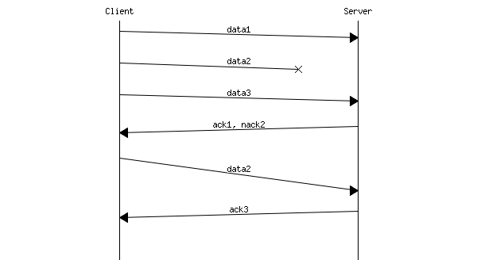

mscgen filter for AsciiDoc
==========================

Mscgen (link:http://www.mcternan.me.uk/mscgen/[]) is a small program that parses
Message Sequence Chart descriptions and produces PNG, SVG, EPS or server side
image maps (ismaps) as the output. The program and the language it parses are
similar to the Graphviz Dot tools.

Using the AsciiDoc mscgen filter, Message Sequence Chart descriptions can be
embedded into AsciiDoc documents and processed into either PNG bitmap or SVG
vector graphics.

For example this ASCII text:

[listing]
.....................................................................
msc {
 arcgradient = 8;

 a [label="Client"],b [label="Server"];

 a=>b [label="data1"];
 a-xb [label="data2"];
 a=>b [label="data3"];
 a<=b [label="ack1, nack2"];
 a=>b [label="data2", arcskip="1"];
 |||;
 a<=b [label="ack3"];
 |||;
}
.....................................................................

renders:

More information and examples can be found on the link:https://cdn.rawgit.com/hwmaier/asciidoc-mscgen-filter/master/asciidoc-mscgen-readme.html[README page].